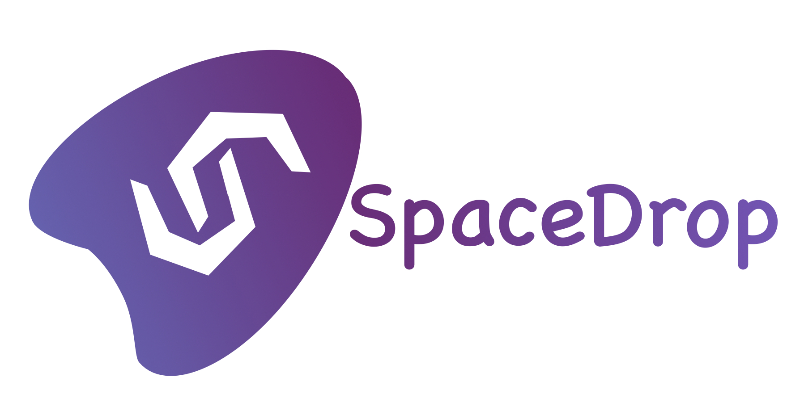

# SpaceDrop

Space-themed mobile game for token airdrops on Flow with in-game NFT assets. Why Airdrop when you can Spacedrop?

 

## Contract deployments

**Flow Testnet**

| Contract | Deployment  |
| :----- | :- |
| SpaceDropNFT  | [`0x31c5fa0de1f0fedf`](https://testnet.flowscan.org/contract/A.31c5fa0de1f0fedf.SpaceDropNFT) |
| SampleToken | [`0x31c5fa0de1f0fedf`](https://testnet.flowscan.org/contract/A.31c5fa0de1f0fedf.SampleToken)|

## Setup

- Open the project with the Unity editor.

### Run the emulator

- Select Window -> Flow -> Flow Control
- In FlowControlManager, select path for Emulator data directory as /Assets/SpaceDrop/Scripts/Cadence
- Click on start emulator
- Run the script [emulator_run.bat](https://github.com/UltimateRoman/SpaceDrop/blob/master/Assets/SpaceDrop/Scripts/Cadence/emulator_run.bat) (on windows) or [emulator_run.sh](https://github.com/UltimateRoman/SpaceDrop/blob/master/Assets/SpaceDrop/Scripts/Cadence/emulator_run.sh) (on linux)
- Edit the emulator endpoint url [here](https://github.com/UltimateRoman/SpaceDrop/blob/d29dfdca5f44d585b67d093542eb21f31c66e915/Assets/SpaceDrop/Scripts/FlowInterface.cs#L73)

### Build

- Select “Install” tab and click on “Add Modules” button. Then add the following modules:
  -  Android – “Android Build Support” with “Android SDK & NDK Tools” and “OpenJDK”.
- Once the unity editor is open in the game window choose portrait mode 
- Go to file and select Build Settings as Android
- Click on Build to generate the APK
